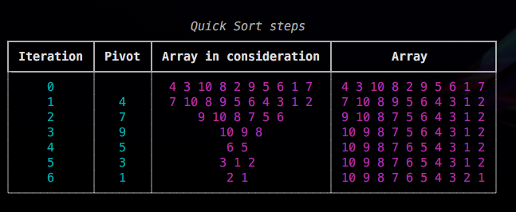
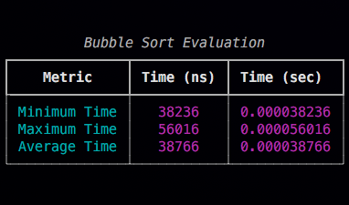
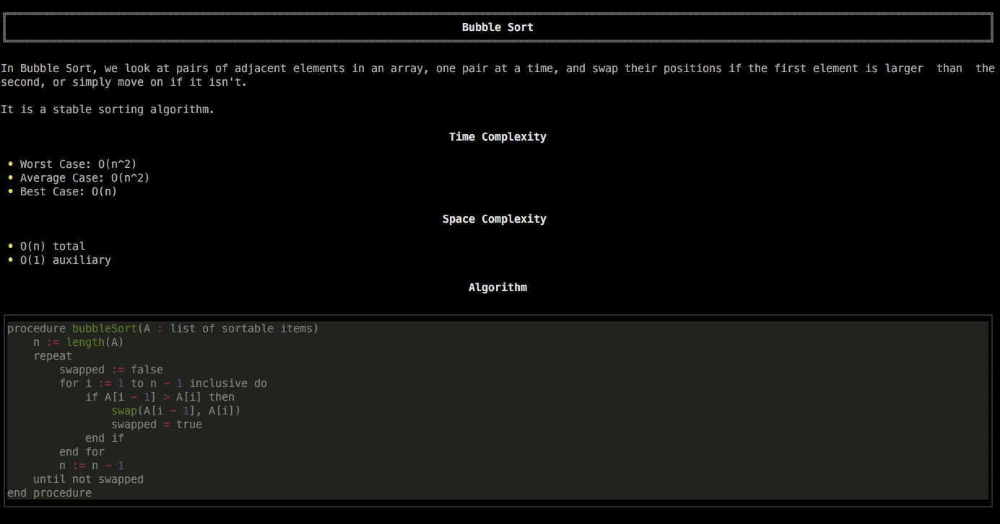
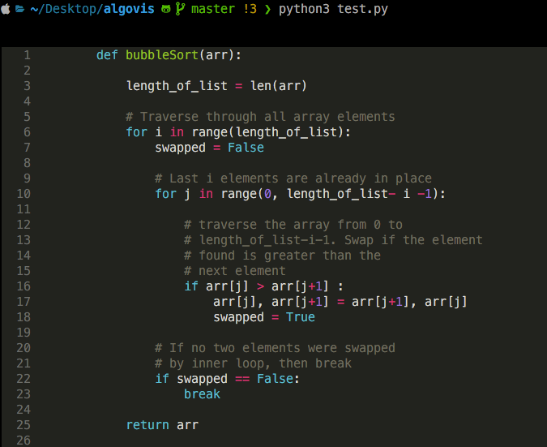
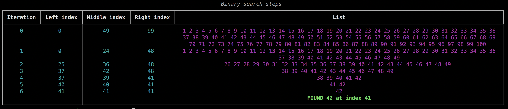

[](https://www.codefactor.io/repository/github/hotshot07/algovis/overview/master)    [](https://pepy.tech/project/algovis) <!--  -->     [](https://mackweb.in) [](https://twitter.com/elonmusk)


Algovis is a python library made for visualizing algorithms. Refer to the [documentation](https://algovisdocs.netlify.app/) for more info.

Currently the library has these algorithms

#### Sorting

- Bubble Sort
- Insertion Sort
- Selection Sort
- Merge Sort
- Quick Sort

#### Searching

- Linear Search
- Binary Search


## Getting Started

### Prerequisites

I would highly suggest creating a virtual environment. Python “Virtual Environments” allow Python packages to be installed in an isolated location for a particular application, rather than being installed globally. You can read more about them [here](https://realpython.com/python-virtual-environments-a-primer/).

```bash
# creating a test folder

$mkdir test_algovis

# make it the current directory

$cd test_algovis

# creating a virtual environment (you can replace envname with whatever name you like)

$python3 -m venv envname

# activating it

$source envname/bin/activate
```

You can only access algovis inside this virtual environment. To leave this virtual env when you're done trying out the library, type

```bash
$deactivate
```

### Installing

```bash
$pip3 install algovis
```


### Using the sorting package


#### Visualize method

```python
# import the sorting package from library
from algovis import sorting

# importing random module to shuffle the list
import random

# Making a list of 100 integers from 1-100
# using list comprehension
my_list = [i+1 for i in range(100)]

# shuffling the list
random.shuffle(my_list)

# making a BubbleSort class object by passing the shuffled list
bs_object = sorting.BubbleSort(my_list)

# calling the visualize method
bs_object.visualize(interval= 100)
```
##### Output


#### sort method

```python
# lets work on a shorter example now
my_list = [i + 1 for i in range(10)]

# shuffling the list using random module
random.shuffle(my_list)

#making a quicksort object
qs_object = sorting.QuickSort(my_list)

#sorting in reverse with steps
qs_object.sort(pivot = "first", steps = True, reverse = True)

# you can see the pivot placed correctly in the 'array in consideration' column
# the state of whole array at that iteration is shown in 'array' column
```

##### Output



#### evaluate method
```python
# calling the evaluate method and passing the optional parameter 'iterations'
# the list is sorted 'iterations' number of times and the min, max and average time taken
#to sort the list is returned in form of a formatted table
bs_object.evaluate(iterations = 100)
```
##### Output



#### info method
```python
# This method gives us information about the algorithm
bs_object.info()
```
##### Output



#### code method
```python
# It prints out the function for the algorithm
bs_object.code()
```
###### Output


>My terminal config is iTerm2 + ohmyzsh + powerlevel10k with dark backgroud. Colors may appear different in your terminal output. It's recommended to change the terminal color to something darker

### Using the searching package

>The searching package has the same methods as sorting, just instead of 'sort' you have 'search'
>Refer to the [documentation](https://algovisdocs.netlify.app/) for more info

#### search method
```python
#importing searching package
from algovis import searching

# making a list of integers from 1 to 100
# using list comprehension
my_list = [i+1 for i in range(100)]

#making binary search object
bin_search = searching.BinarySearch(my_list)

#calling the search method
bin_search.search(42, steps = True)
```



#### visualize method

```python
# calling the visualize method
# interval is the time between two different frames of the animation
bin_search.visualize(42, interval = 1000)
```


```python
# or if you want to linear search 42
lin_search = searching.LinearSearch(my_list)

# setting a less interval to make a much faster animation
lin_search.visualize(42, interval = 100)
```


### Built With

* [Poetry](https://python-poetry.org/) - Python packaging and dependency management tool
* [Matplotlib](https://pypi.org/project/matplotlib/) - Matplotlib is a comprehensive library for creating static, animated, and interactive visualizations in Python.
* [Rich](https://pypi.org/project/rich/) - Rich is a Python library for rich text and beautiful formatting in the terminal made

### Doumentation
The documentation is built with [MKdocs](https://www.mkdocs.org/) using [material](https://squidfunk.github.io/mkdocs-material/) theme and is hosted on netlify. You can read it [here](https://algovisdocs.netlify.app/)

### Author

* **Mayank Arora** *(hotshot07)*

### Acknowledgements
* My 2019 13" base MacBook Pro, which, I realised in the process of making this library is very underpowered
* [StackAbuse](https://stackabuse.com)
* [GeeksForGeeks](https://www.geeksforgeeks.org)


### License

This project is licensed under the GNU Affero General Public License v3 (AGPL-3.0) - see the [LICENSE](LICENSE) file for details
